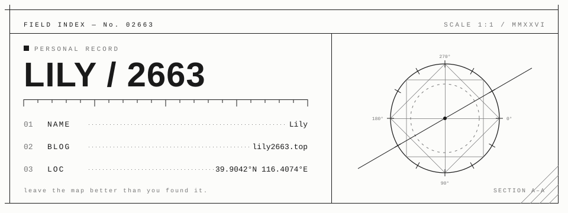

  <picture>
    <source media="(prefers-color-scheme: dark)" srcset="./assets/profile-card-dark.svg">
    <source media="(prefers-color-scheme: light)" srcset="./assets/profile-card-light.svg">
    
  </picture>

  
  
  

## Hello, map reader

Hello,I'lily.

I build at the intersection of **personal publishing**, **playful interfaces**, and **security curiosity**. Most days, that means shaping Hugo themes, small Node.js tools, and experiments that make the web feel a little more personal.

## Coordinates

| Project | What it maps |
| :-- | :-- |
| **[LilyMap](https://github.com/lily2663/lilymap)** | A local-first control room for writing, previewing, configuring, and publishing Hugo sites. |
| **[lily-epitaph](https://github.com/lily2663/lily-epitaph)** | A watercolor-night Hugo theme built around modular layouts, long-form reading, and a tiny roaming companion. |
| **[lily's house](https://github.com/lily2663/lily2663.github.io)** | My personal corner of the web: notes, experiments, and traces from the journey. |

  
  
  
  
  
  

Leave the map better than you found it.

