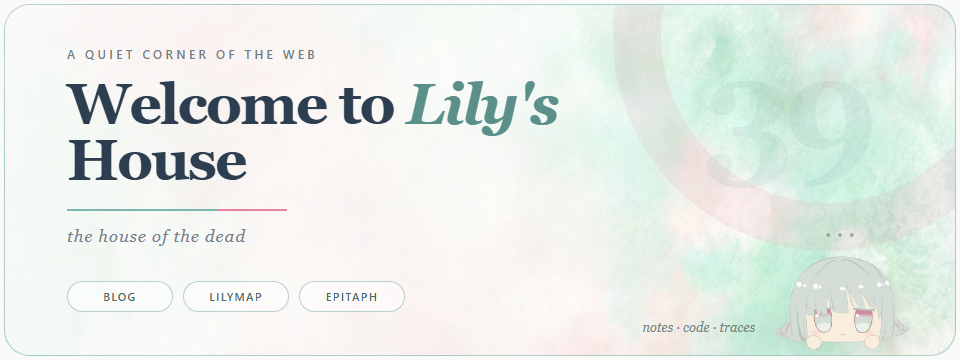

  <picture>
    <source media="(prefers-color-scheme: dark)" srcset="./assets/profile-card-night.png">
    <source media="(prefers-color-scheme: light)" srcset="./assets/profile-card-day.png">
    
  </picture>

  <a href="https://lily2663.top">enter the house</a>
  &nbsp;·&nbsp;
  <a href="https://github.com/lily2663/lilymap">LilyMap</a>
  &nbsp;·&nbsp;
  <a href="https://github.com/lily2663/lily-epitaph">lily-epitaph</a>

<i>the house of the dead</i>

## A little about this house

我是 Lily。这里放着一些文字、代码、小工具，以及总会在深夜继续长出来的想法。

我喜欢把个人网站做得像一个可以慢慢添置的房间：有好读的长文、有一点轻微的玩心，也有足够可靠的工具把它一直维持下去。

## Things growing here

- **[LilyMap](https://github.com/lily2663/lilymap)** — 给 Hugo 博客准备的本地管理台：写作、预览、配置与发布。
- **[lily-epitaph](https://github.com/lily2663/lily-epitaph)** — 有水彩昼夜背景、模块化版式和团子的 Hugo 主题。
- **[lily's house](https://lily2663.top)** — 个人博客，记录技术、折腾与一些暂时不想归类的东西。

notes · code · traces

